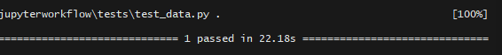
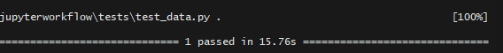

# Reproductible-Jupyter-Workflow

Demonstration of Jupyter workflow example

### Objectif:

The objective is to go from a non-linear, interactive and test style, to a more linear and reproducible analysis.

### Content:

#### Part 1: Loading and Visualizing Data

    Download the Fremont Bridge bicycle data and produce some basic visualizations in the Jupyter notebook.

[Fremont bridge data](https://data.seattle.gov/api/views/65db-xm6k/rows.csv?accessType=DOWNLOAD)

#### Part 2: Further Data Exploration

    Dive a bit deeper into the exploration of the Fremont bridge data.

#### Part 3: Creating a function that check data download utility

    Refactor our data download code to make it more useful in the long-run.

#### Part 4: Creating a Python Package

    Move some of our generally-useful routines into a separate Python package.

#### Part 5: Unit Testing with PyTest

    Write unit tests using the pytest package to ensure that our Python code is operating correctly.
    We notice that check_fremont_data() function runs slowly.

#### Part 6: Refactoring for Speed

    Refactoring a slow piece of our code, ensuring that it passes our previous unit tests.
    We notice that check_fremont_data() function runs a little bit fast.

#### Part 7: Further Data Exploration: PCA and GMM

    Diving deeper into the data analysis, doing some unsupervised learning, including Principal Component Analysis and Gaussian Mixture Models.

[Link to the Jupyter Note book workflow](Workflow.py.ipynb)
